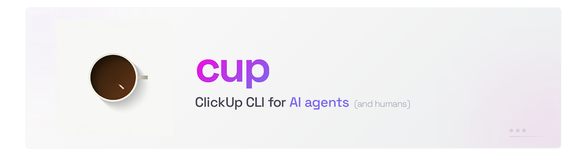

<p align="center">
  
</p>

<p align="center">
  <a href="https://www.npmjs.com/package/@krodak/clickup-cli"></a>
  <a href="https://nodejs.org"></a>
  <a href="./LICENSE"></a>
  <a href="https://github.com/krodak/clickup-cli/actions/workflows/ci.yml"></a>
  <a href="https://github.com/krodak/homebrew-tap"></a>
</p>

```bash
npm install -g @krodak/clickup-cli && cup init
```

`cup` is the binary name. The previous `cu` name was retired in v0.21.0 to avoid conflict with the Unix [cu(1)](<https://en.wikipedia.org/wiki/Cu_(Unix_utility)>) utility.

## Talk to your agent

Install the CLI, add the skill file to your agent, and it works with ClickUp. No API knowledge needed.

> **"Read task abc123, do the work, then mark it in review and leave a comment with the commit hash."**

> **"What's my standup? What did I finish, what's in progress, what's overdue?"**

> **"Create a subtask under the initiative for the edge case we found."**

> **"Check my sprint and tell me what's behind schedule."**

> **"Update the description with your findings and flag blockers in a comment."**

The agent reads the skill file, picks the right `cup` commands, and handles everything. You don't need to learn the CLI - the agent does.

### Agent mode

When piped (no TTY), output is Markdown optimized for AI context windows. Pass `--json` for structured data.


### Terminal mode

In a terminal, you get interactive tables with colors. Most commands scope to your assigned tasks by default.


## Why a CLI and not MCP?

A CLI + skill file has fewer moving parts. No server process, no protocol layer. The agent already knows how to run shell commands - the skill file teaches it which ones exist. For tool-use with coding agents, CLI + instructions tends to work better than MCP in practice.

## Install

You need Node 22+ and a ClickUp personal API token (`pk_...` from [ClickUp Settings > Apps](https://app.clickup.com/settings/apps)).

<details open>
<summary>&nbsp;&nbsp;<strong>npm</strong></summary>

```bash
npm install -g @krodak/clickup-cli
cup init
```

</details>

<details>
<summary>&nbsp;&nbsp;<strong>Homebrew</strong></summary>

```bash
brew tap krodak/tap
brew install clickup-cli
cup init
```

</details>

## Set up your agent

The package includes a [skill file](https://agentskills.io) that teaches agents all available commands and when to use them. All three major coding agents support skills natively:

<details open>
<summary>&nbsp;&nbsp;<strong>Claude Code</strong></summary>

**Install as a [plugin](https://docs.anthropic.com/en/docs/claude-code/plugins)** (recommended):

```bash
claude plugin add $(npm root -g)/@krodak/clickup-cli
```

This registers the skill under the `clickup-cli:` namespace. Claude loads it automatically when you work with ClickUp tasks.

**Or install as a personal skill** (no namespace prefix):

```bash
SKILL=$(npm root -g)/@krodak/clickup-cli/skills/clickup-cli
mkdir -p ~/.claude/skills/clickup
cp "$SKILL/SKILL.md" ~/.claude/skills/clickup/SKILL.md
```

</details>

<details>
<summary>&nbsp;&nbsp;<strong>Codex</strong></summary>

Codex supports [agent skills](https://developers.openai.com/codex/skills) across CLI, IDE extension, and web. Skills use the same `SKILL.md` format with YAML frontmatter.

**Install as a user skill** (available across all your projects):

```bash
SKILL=$(npm root -g)/@krodak/clickup-cli/skills/clickup-cli
mkdir -p ~/.agents/skills/clickup
cp "$SKILL/SKILL.md" ~/.agents/skills/clickup/SKILL.md
```

**Or install as a project skill** (checked into your repo):

```bash
SKILL=$(npm root -g)/@krodak/clickup-cli/skills/clickup-cli
mkdir -p .agents/skills/clickup
cp "$SKILL/SKILL.md" .agents/skills/clickup/SKILL.md
```

You can also use the built-in installer: `$skill-installer clickup`

</details>

<details>
<summary>&nbsp;&nbsp;<strong>OpenCode</strong></summary>

```bash
SKILL=$(npm root -g)/@krodak/clickup-cli/skills/clickup-cli
mkdir -p ~/.config/opencode/skills/clickup
cp "$SKILL/SKILL.md" ~/.config/opencode/skills/clickup/SKILL.md
```

</details>

<details>
<summary>&nbsp;<strong>Other agents</strong></summary>

The skill file follows the [Agent Skills](https://agentskills.io) open standard. Copy `skills/clickup-cli/SKILL.md` into your agent's skill directory, system prompt, or `AGENTS.md`.

</details>

## What it covers

Full CRUD for the core ClickUp workflow:

| Area                 | Capabilities                                                                                                            |
| -------------------- | ----------------------------------------------------------------------------------------------------------------------- |
| ✅ **Tasks**         | Create, read, update, delete, duplicate, search, subtasks, assign, dependencies, links, multi-list, bulk status updates |
| 💬 **Comments**      | Post, edit, delete, threaded replies, notify all                                                                        |
| 📄 **Docs**          | List, read, create, edit, delete (v3 API)                                                                               |
| ⏱️ **Time Tracking** | Start/stop timer, log entries, list/update/delete history                                                               |
| ☑️ **Checklists**    | View, create, delete, add/edit/delete items                                                                             |
| 🔧 **Custom Fields** | List, set, remove values (dropdown, date, checkbox, text, etc.)                                                         |
| 🏷️ **Tags**          | Add/remove on tasks, space-level create/update/delete                                                                   |
| 🎯 **Goals & OKRs**  | Goals CRUD, key results CRUD                                                                                            |
| 🏃 **Sprints**       | Auto-detect active sprint, flexible date parsing, config override                                                       |
| 🏢 **Workspace**     | Spaces, folders, lists, members, task types, templates                                                                  |
| 📎 **Attachments**   | Upload files to tasks, shown in detail views                                                                            |

[Full API coverage details](docs/api-coverage.md) | [Command reference](docs/commands.md)

## Configuration

### Profiles

Multiple profiles for different workspaces or accounts:

```bash
cup profile add work        # interactive setup
cup profile add personal    # another workspace
cup profile list            # show all profiles
cup profile use personal    # switch default
cup tasks -p work           # one-off profile override
```

### Config file

`~/.config/cup/config.json` (or `$XDG_CONFIG_HOME/cup/config.json`):

```json
{
  "defaultProfile": "work",
  "profiles": {
    "work": {
      "apiToken": "pk_...",
      "teamId": "12345678",
      "sprintFolderId": "optional"
    },
    "personal": {
      "apiToken": "pk_...",
      "teamId": "87654321"
    }
  }
}
```

Old flat configs (pre-profiles) are auto-migrated on first load.

### Environment variables

Environment variables override config file values:

| Variable       | Description                                                       |
| -------------- | ----------------------------------------------------------------- |
| `CU_API_TOKEN` | ClickUp personal API token (`pk_`)                                |
| `CU_TEAM_ID`   | Workspace (team) ID                                               |
| `CU_PROFILE`   | Profile name (overrides `defaultProfile`, overridden by `-p`)     |
| `CU_OUTPUT`    | Set to `json` to force JSON output when piped (default: markdown) |

When both `CU_API_TOKEN` and `CU_TEAM_ID` are set, the config file is not required. Useful for CI/CD and containerized agents.

## Development

```bash
npm install
npm test          # unit tests (vitest, tests/unit/)
npm run test:e2e  # e2e tests (tests/e2e/, requires CLICKUP_API_TOKEN in .env.test)
npm run build     # tsup -> dist/
```
